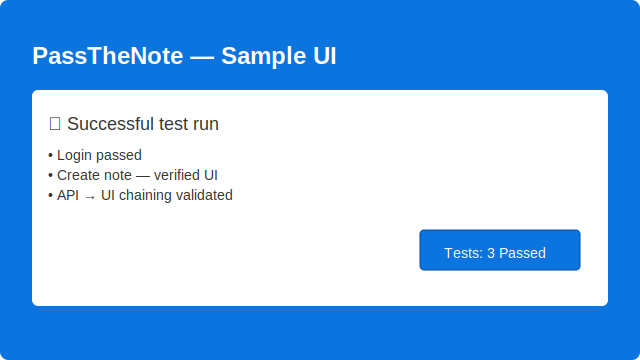

# Helix Automation Framework

[](https://github.com/pallabbhowmik/helix-automation-framework/actions)

Helix is a small, practical automation framework for UI and API testing. It demonstrates engineering-grade automation patterns while exercising the public PassTheNote sandbox (https://www.passthenote.com).

Table of contents
-----------------
- [Overview](#helix-automation-framework)
- [Architecture overview](#architecture-overview)
- [Configuration](#configuration)
- [Getting started & running tests](#getting-started--running-tests)
- [Examples](#examples)
- [Roadmap & contributing](#roadmap--contributing)
- [License & maintainer](#license--maintainer)

Overview
--------
Target application: https://www.passthenote.com

Helix focuses on demonstrating a dependable test automation stack using POM (UI), RestAssured (API), and small integration flows that seed data via API then verify in the UI.

Architecture overview
---------------------
The framework is intentionally small and layered so tests remain readable and maintainable. Main modules:

- api — RestAssured request specs, API clients and request/response models (DTOs)
- config — layered configuration loader (system props → env vars → .env.config → classpath)
- core — WebDriver lifecycle, BasePage/BaseTest, listeners and utilities
- pages — Page Object Model classes and stable locators
- flows — reusable business flows that combine pages (e.g. login, checkout)

This structure keeps UI and API logic isolated and reusable, and makes it straightforward to add new E2E flows.

Configuration
-------------
Configuration is resolved in this order (highest → lowest):
1. System properties (eg. `-Dweb.baseUrl`)
2. Environment variables
3. `.env.config` at repository root (local overrides)
4. Classpath properties (`config-<env>.properties`)

Sample `.env.config.example`
----------------------------
Copy this file to `.env.config` locally and update values for your environment (do not commit credentials):

```
# Web UI base URL (host only — no path)
BASE_URL=https://www.passthenote.com

# API gateway base URL used by API tests
API_BASE_URL=https://www.passthenote.com/api/v1

# Credentials for demo/test accounts (use secrets in CI)
USERNAME=admin@passthenote.com
PASSWORD=Admin@123

# Test runner preferences
BROWSER=chrome
RUN_TYPE=FULL
```

Getting started & running tests
------------------------------
Build the project (skip tests):

```powershell
./gradlew clean build -x test
```

Run the full test suite (defaults to `env=dev`):

```powershell
./gradlew clean test -Denv=dev -Dbrowser=chrome
```

Run tests by groups (example: `api`, `ui`):

```powershell
./gradlew clean test -Denv=dev -Dgroups=api
./gradlew clean test -Denv=dev -Dgroups=ui
```

Examples
--------
UI (Page Object Model):

```java
LoginPage login = new LoginPage();
login.open();
login.enterEmail(USERNAME);
login.enterPassword(PASSWORD);
login.clickSignIn();
assertTrue(login.isDashboardDisplayed());
```

API (RestAssured):

```java
AuthRequest req = new AuthRequest(USERNAME, PASSWORD);
AuthResponse res = ApiSpecs.base()
    .body(req)
    .post("/auth/login")
    .then()
    .statusCode(200)
    .extract()
    .as(AuthResponse.class);
assertNotNull(res.getToken());
```

Long-running / cross-layer patterns
----------------------------------
- Prefer API → UI chaining for reliable E2E flows: seed data using API and verify via UI.
- Keep tests self-contained and clean up resources where possible to avoid shared-state flakiness.

Screenshot
----------
Below is a sample visual showing a successful UI flow or app screenshot. (placeholder image included in `docs/images`)



Roadmap & contributing
----------------------
Planned next steps (concise, non-duplicated):

1. Add more E2E flows to cover commerce, notes collaboration and role-based admin flows.
2. Improve report integrations (Allure) and provide CI examples (GitHub Actions) with status badges.
3. Add idempotent cleanup helpers, retry tuning and parallel execution improvements to stabilize runs.

Contributing guidelines
-----------------------
- Open issues or pull requests; keep PRs small and focused.
- Follow the repository code style and existing patterns (POM, flows, config).
- Never commit secrets — use `.env.config` or CI secrets.

License & maintainer
--------------------
MIT — see LICENSE for details.

Maintainer: Pallab Bhowmik — Senior SDET
# Helix Automation Framework

Helix is a practical automation framework for UI and API testing. It demonstrates engineering-grade automation patterns while exercising the public PassTheNote sandbox (https://www.passthenote.com).

Key features
------------
- Page Object Model (POM) layer for stable UI interactions
- RestAssured API clients and DTOs
- Reusable flows that combine UI and API steps (integration tests)
- Layered configuration with sensible defaults for public sandbox testing

Target application
------------------
All tests target the public PassTheNote sandbox at:

https://www.passthenote.com

Please do not include sub-paths (for example `/app`) in your `BASE_URL` — use the host above.

Repository layout
-----------------
src/main/java/com/helix/automation/framework
- api/     - RestAssured specs, clients and models
- config/  - ConfigManager: layered configuration loader
- core/    - Driver lifecycle, base tests, listeners and helpers
- pages/   - Page Objects and stable locators
- flows/   - Reusable business flows across pages

src/test/java/com/helix/automation/tests
- ui/         - Selenium UI test suites
- api/        - RestAssured API suites
- integration - Tests that combine API seeding + UI verification

Architecture overview
---------------------
The framework follows a small layered architecture: API, config, core, pages and flows. This keeps tests thin and maintainable and makes it straightforward to add new modules and end-to-end scenarios.

Configuration
-------------
Configuration is resolved using this precedence (highest → lowest):
1. System properties (eg. `-Dweb.baseUrl`)
2. Environment variables
3. `.env.config` at repository root (developer overrides)
4. Classpath properties (`config-<env>.properties`)

Example `.env.config` (local, never commit credentials):

```
BASE_URL=https://www.passthenote.com
API_BASE_URL=https://www.passthenote.com/api/v1
USERNAME=admin@passthenote.com
PASSWORD=Admin@123
```

Running tests
-------------
Build without tests:
```powershell
./gradlew clean build -x test
```

Run full test-suite:
```powershell
./gradlew clean test -Denv=dev -Dbrowser=chrome
```

Run particular groups:
```powershell
./gradlew clean test -Denv=dev -Dgroups=api
./gradlew clean test -Denv=dev -Dgroups=ui
```

Best practices
--------------
- Prefer stable `data-test` attributes in POMs and use id → name → css → xpath fallback when necessary.
- Make tests deterministic: create required data during each test and clean up when possible.
- Prefer API→UI chaining for stable end-to-end scenarios (seed via API → verify UI).
- Do not commit secrets; use a local `.env.config` or CI secrets.

Examples
--------
UI (POM):
```java
LoginPage login = new LoginPage();
login.open();
login.enterEmail(USERNAME);
login.enterPassword(PASSWORD);
login.clickSignIn();
assertTrue(login.isDashboardDisplayed());
```

API (RestAssured):
```java
AuthRequest req = new AuthRequest(USERNAME, PASSWORD);
AuthResponse res = ApiSpecs.base()
    .body(req)
    .post("/auth/login")
    .then()
    .statusCode(200)
    .extract()
    .as(AuthResponse.class);
assertNotNull(res.getToken());
```

Roadmap & contribution
----------------------
- Add more E2E flows (commerce, notes collaboration)
- Improve reporting (Allure) and CI examples (GitHub Actions)
- Add idempotent cleanup helpers to reduce data coupling

Contributing: open issues or PRs and avoid committing secrets. License: MIT — see LICENSE for details.

Maintainer
----------
Pallab Bhowmik — Senior SDET
